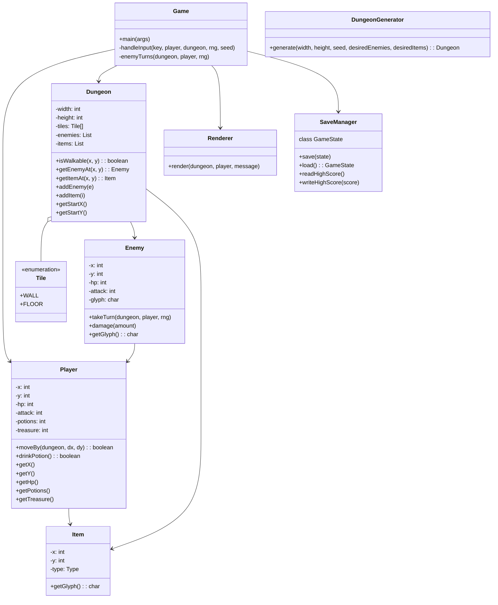

## Adventure Crawler (POC)

A tiny, self-contained Java 17 roguelike dungeon crawler proof‑of‑concept focused on:
- Procedural generation (rooms + corridors, randomized enemies and loot)
- Turn-based movement with live enemy responses after the player acts
- ASCII rendering, WASD movement, basic combat/looting, lightweight save/load

This POC is intentionally minimal and console-based to keep the scope small. It is structured so you can later swap the renderer/input layer for JavaFX or LibGDX.

### Features
- New randomized dungeon on each run (seeded by current time)
- WASD movement, F to attack adjacent enemies, E to drink potion, Q to save and quit
- Enemies chase/attack; simple AI with “chase if nearby, wander otherwise”
- Loot potions and treasure; HP, potions, and gold shown in HUD
- Permadeath: when you die, the save is wiped; high score tracked separately
- Simple save/load between runs (on Q)

### Controls
- W/A/S/D: move
- F: attack in all four adjacent tiles
- E: drink a potion (+8 HP, capped at 20)
- Q: save and quit (resume next time you run)

### Project Layout
- `src/main/java/com/adventure/crawler`
  - `Game` — entry point and game loop (handles input, turns, save/load)
  - `Renderer` — ASCII renderer (prints map, HUD, messages)
  - `Dungeon`, `DungeonGenerator` — map grid and procedural generator
  - `Player`, `Enemy`, `Item`, `Tile` — core entities and tile enum
  - `SaveManager` — simple text-file save/highscore
- `saves/` — save and high score files (created at runtime)

### Build and Run (CLI)
Requires Java 17+ (`javac`, `java`).

```bash
# From repo root
javac --release 17 -d out $(find src/main/java -name "*.java")
java -cp out com.adventure.crawler.Game
```

Tip: to verify quickly, you can auto-quit with a save using:
```bash
printf q | java -cp out com.adventure.crawler.Game
```

### Run in VS Code or IntelliJ
- Open the folder, mark `src/main/java` as a source root if prompted.
- Create a Run Configuration with main class `com.adventure.crawler.Game`.

### Save/Load Details
- Press `Q` to save and quit. Save file lives under `saves/save.txt`.
- On next launch, the game will load the save and resume.
- On death, the save file is deleted (permadeath). `saves/highscore.txt` keeps your best gold count.

### Next Steps (Optional)
- Swap ASCII for JavaFX or LibGDX tile rendering
- Add classes (e.g., Warrior/Mage) and elemental damage
- Improve procedural fairness (e.g., guaranteed reachable loot, difficulty ramp)
- Field-of-view, fog of war, more enemy types and items

### License
MIT (or adapt to your needs).

